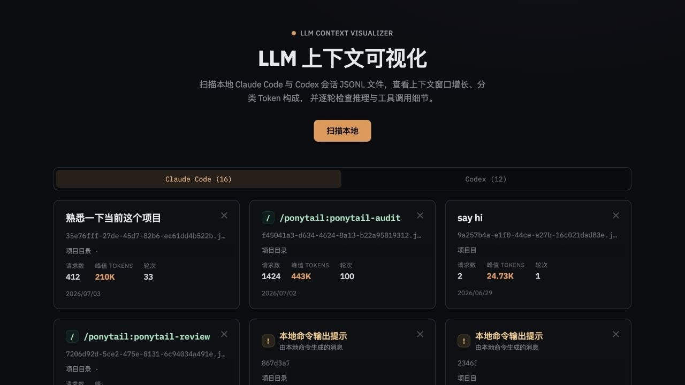
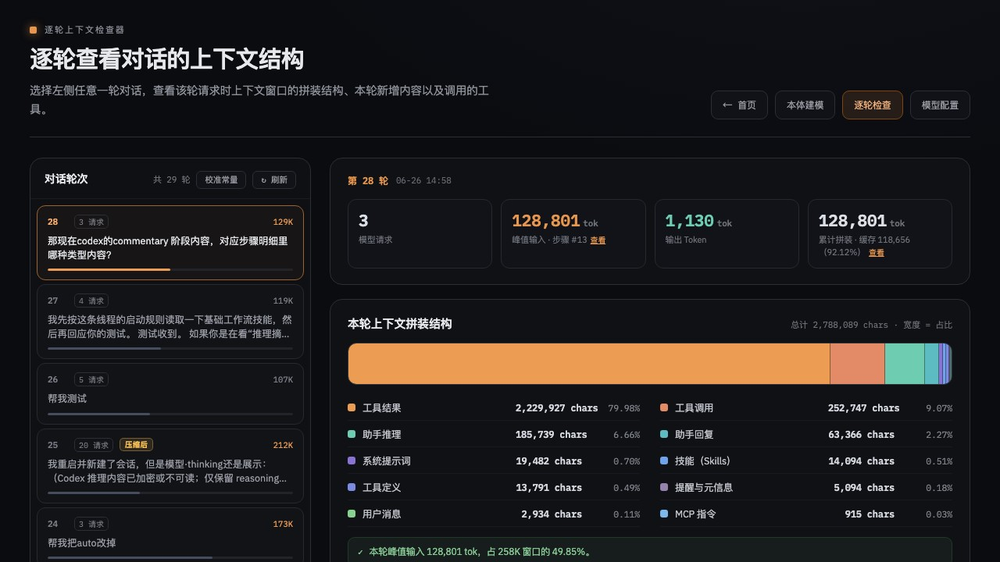
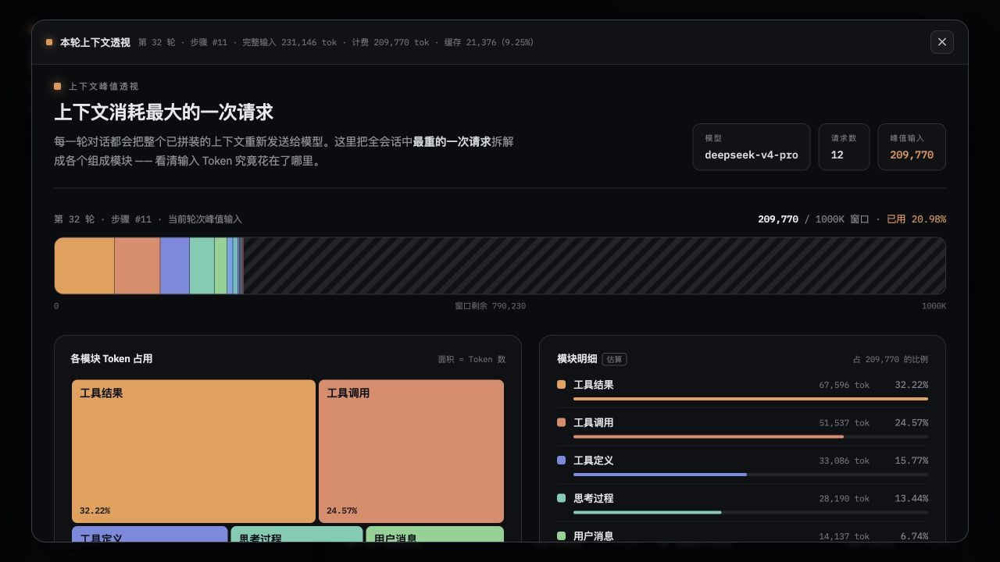
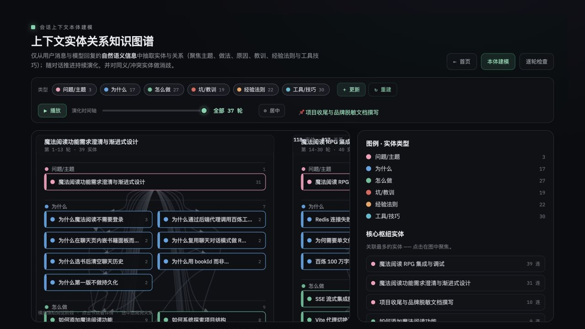
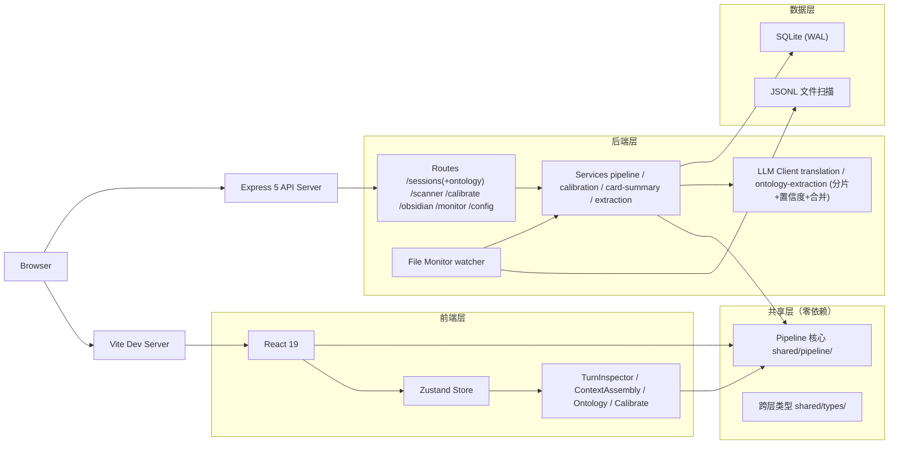

# LLM Context Viz

[](https://nodejs.org/)
[](https://react.dev/)
[](https://www.typescriptlang.org/)
[](package.json)
[](LICENSE)

> LLM 对话上下文可视化工具——扫描本地 Claude Code / Codex 会话记录，以交互式 UI 展示 token 分布、turn 结构与上下文演变。

<br>

LLM Context Viz 是一个基于 **Express + React** 构建的本地工具，支持将 LLM 会话 JSONL 文件导入 SQLite 数据库，并提供多维度的可视化分析。核心特性：

- **会话扫描** — 递归扫描 `~/.claude/projects/`、`~/.codex/sessions/` 和 `~/.codex/archived_sessions/`，SHA256 去重，增量导入。支持 Claude Code（Anthropic SDK 格式）和 Codex（OpenAI 兼容格式）两种 JSONL 来源
- **处理管道** — 五阶段同步管道（解析 → Turn 分组 → Token 计算 → 时间线拆解 → 摘要聚合），核心逻辑集中在 `shared/pipeline/`，前后端零依赖共享
- **Turn 检查器** — 按 turn 粒度拆解 token 分布（模型 / 子代理 / 工具 / 系统 / 用户），支持执行时间线、token 增量面板、工具使用统计
- **上下文组装视图** — 柱状图展示 context window 内 token 占用，按类别（system prompt、tool call、content block）拆解，含增长趋势折线图
- **LLM 翻译** — 对 tool call 参数 / 结果进行中文翻译（Chat Completions 兼容端点），支持项目常量缓存翻译
- **本体提取** — 从会话内容中自动提取概念节点和关系边，分片并发、置信度评分、缓存复用、失败分片重跑，SSE 流式返回并保持长连接
- **校准系统** — 校准 LLM 分析参数（手动 + 自动检测），按来源（claude/codex）独立维护，用于分类器微调和 token 估算
- **模型配置** — 管理 `LLM_API_KEY`、自定义端点、模型选择，支持 `~/.llm-context-viz/.env`、项目 `.env` 和环境变量

<br>

## 功能展示

### 会话首页



### 逐轮检查



### 上下文拆解



### 本体图谱



<br>

## 服务架构



<br>

## 快速开始

### 本地开发

```bash
git clone https://github.com/ghoshadow/llm-context-viz.git
cd llm-context-viz
npm install

# 开发模式（两个终端分别启动前端和后端）
npm run dev          # Vite dev server（前端，端口 5173）
npm run server       # Express API server（后端，端口 4137）
```

生产模式由 Express 托管构建后的前端：

```bash
npm run build
NODE_ENV=production npm run server
```

当前项目是 Web 本地工具，近期已移除 Tauri/桌面打包脚本。

### 首次启动

1. （可选）配置 LLM API 密钥以启用翻译和本体提取功能
2. 打开前端页面，点击「扫描会话」导入本地 JSONL 文件
3. 选择会话进入 Turn 检查器或上下文组装视图

<br>

## WebUI 页面

| 页面 | 路由 | 说明 |
| :-- | :-- | :-- |
| 首页 | `#home` | 会话列表、扫描入口、模型配置 |
| Turn 检查器 | `#inspector` | 单次对话 turn 的 token 分布详情 |
| 上下文组装 | `#assembly` | 柱状图展示 context window token 占用 |
| 本体图谱 | `#ontology` | 概念节点和关系边的可视化 |
| 校准面板 | `#calibrate` | LLM 分析参数校准与管理 |
| 扫描弹窗 | 全局 | 选择会话来源、预览、导入 |

<br>

## 环境变量

| 变量 | 说明 | 默认值 |
| :-- | :-- | :-- |
| `PORT` | 服务器端口 | `4137` |
| `VITE_PORT` | Vite 开发服务器端口 | `5173` |
| `LLM_BASE_URL` | 本体提取 / 卡片总结端点（Anthropic 兼容） | `https://api.deepseek.com/anthropic` |
| `LLM_API_KEY` | LLM API 密钥；运行时会安全映射给 Claude Agent SDK 子进程 | — |
| `LLM_MODEL` | 本体提取 / 卡片总结模型 | `deepseek-v4-pro` |
| `TRANSLATION_BASE_URL` | 翻译端点（Chat Completions 兼容） | `https://api.deepseek.com/chat/completions` |
| `TRANSLATION_MODEL` | 翻译模型 | `deepseek-v4-flash` |
| `TRANSLATION_MAX_TOKENS` | 翻译请求最大输出 token（可选） | — |
| `NODE_ENV` | 运行环境 | `development` |
| `LLM_CONTEXT_VIZ_DATA_DIR` | 数据目录覆盖 | `./data` |

<br>

## API 一览

所有 API 前缀为 `/api`，默认监听 `http://localhost:4137`。

| 接口 | 方法 | 说明 |
| :-- | :-- | :-- |
| `/api/health` | `GET` | 健康检查，返回服务状态和数据目录 |
| `/api/sessions` | `GET` | 获取全部会话列表 |
| `/api/sessions/:id` | `GET` | 获取单个会话详情 |
| `/api/sessions/:id` | `DELETE` | 删除会话及其关联数据 |
| `/api/sessions/:id/refresh` | `POST` | 重新解析原始 JSONL 并刷新 turn 数据 |
| `/api/sessions/:id/turns` | `GET` | 获取会话 turn 列表（分页） |
| `/api/sessions/:id/turns/:turnIndex` | `GET` | 获取指定 turn 的完整数据 |
| `/api/sessions/:id/translate` | `POST` | 翻译会话中 tool call 内容 |
| `/api/sessions/:id/translations/:turnIndex` | `GET` | 获取 turn 翻译缓存，可带 `constantSections` |
| `/api/sessions/:id/ontology` | `GET` / `POST` / `DELETE` | 读取、保存或删除本体数据 |
| `/api/sessions/:id/ontology/extract` | `POST` | 触发本体提取任务（SSE） |
| `/api/sessions/:id/ontology/extract/status` | `GET` | 查询本体提取任务状态 |
| `/api/sessions/:id/ontology/content-status` | `GET` | 查询会话内容文件拆分状态 |
| `/api/sessions/:id/ontology/content-extract` | `POST` | 将会话内容拆分导出到文件 |
| `/api/sessions/:id/ontology/summarize-card` | `POST` | 启动主题知识卡片总结任务 |
| `/api/sessions/:id/ontology/summarize-card/:topicId` | `GET` / `PUT` | 获取或手动保存主题总结 |
| `/api/sessions/:id/ontology/obsidian-card/:topicId` | `GET` / `POST` | 查询或同步 Obsidian 知识卡片 |
| `/api/scanner/scan` | `GET` | 扫描默认或指定目录下的 JSONL 文件 |
| `/api/scanner/import` | `POST` | 导入选中的 JSONL 文件 |
| `/api/calibrate/current` | `GET` | 读取当前项目和来源的校准常量 |
| `/api/calibrate/apply` | `PUT` | 应用校准常量 |
| `/api/calibrate/auto/start` | `POST` | 启动自动校准任务 |
| `/api/calibrate/auto/:jobId` | `GET` | 查询自动校准任务状态 |
| `/api/calibrate/auto/:jobId/cancel` | `POST` | 取消自动校准任务 |
| `/api/obsidian/config` | `GET` / `PUT` | 读写 Obsidian 集成配置 |
| `/api/config/model` | `GET` / `PUT` | 读写模型配置 |
| `/api/config/home` | `GET` | 获取用户 home 目录路径 |
| `/api/monitor/snapshot` | `GET` | 获取活跃会话上下文快照 |

<details>
<summary><code>GET /api/sessions</code> — 获取会话列表</summary>
<br>

```bash
curl http://localhost:4137/api/sessions
```

响应示例：

```json
[
  {
    "id": "abc123",
    "source": "claude",
    "cwd": "/Users/link/my-project",
    "title": "my-project",
    "turnCount": 42,
    "createdAt": "2026-06-15T10:30:00.000Z"
  }
]
```

<br>
</details>

<details>
<summary><code>GET /api/sessions/:id/turns</code> — 获取 turn 列表</summary>
<br>

```bash
curl "http://localhost:4137/api/sessions/abc123/turns?limit=50&offset=0"
```

| 参数 | 说明 |
| :-- | :-- |
| `limit` | 每页条数，默认 200，最大 500 |
| `offset` | 偏移量 |

<br>
</details>

<details>
<summary><code>GET /api/scanner/scan</code> — 扫描 JSONL 文件</summary>
<br>

```bash
curl "http://localhost:4137/api/scanner/scan?paths=/Users/me/.claude/projects,/Users/me/.codex/sessions&depth=3&force=1"
```

| 参数 | 说明 |
| :-- | :-- |
| `paths` | 要扫描的目录列表，逗号分隔；省略时使用默认 Claude/Codex 会话目录 |
| `depth` | 最大递归深度，默认 `3` |
| `force` | 设为 `1` 时清空扫描缓存并重新计算文件 hash |

<br>
</details>

<details>
<summary><code>POST /api/sessions/:id/translate</code> — 翻译 tool call</summary>
<br>

```bash
curl -X POST http://localhost:4137/api/sessions/abc123/translate \
  -H "Content-Type: application/json" \
  -d '{"text":"hello","turnIndex":3,"stepIndex":1,"sectionIndex":0}'
```

| 字段 | 说明 |
| :-- | :-- |
| `text` | 要翻译的文本 |
| `turnIndex` | Turn 序号（从 0 开始） |
| `stepIndex` | Step 序号 |
| `sectionIndex` | 同一 step 内的文本段序号 |
| `force` | 设为 `true` 时跳过缓存重新翻译 |

<br>
</details>

<details>
<summary><code>POST /api/sessions/:id/ontology/extract</code> — 本体提取（SSE 流式）</summary>
<br>

```bash
curl -N -X POST http://localhost:4137/api/sessions/abc123/ontology/extract \
  -H "Content-Type: application/json" \
  -d '{"shardSize":30,"maxShardChars":45000,"incremental":true,"extractionDepth":"refined"}'
```

响应为 SSE 事件流，空闲时会发送 keepalive；`data` 字段包含提取进度、分片状态和最终统计。

| 字段 | 说明 |
| :-- | :-- |
| `shardSize` | 每个分片的 turn 数，默认 `30` |
| `maxShardChars` | 单个分片最大字符数，默认 `45000` |
| `force` | 忽略缓存重新提取 |
| `incremental` | 与已有本体结果增量合并 |
| `retryFailedOnly` | 只重跑失败分片 |
| `extractionDepth` | `refined` 或 `deep` |

<br>
</details>

<br>

## 配置体系

### 配置分层

| 位置 | 用途 | 生效时机 |
| :-- | :-- | :-- |
| `~/.llm-context-viz/.env` | 前端模型配置写入位置 | 保存后即时生效 |
| 项目 `.env` | 启动前配置（端口、数据目录等） | 服务启动时 |
| `data/llm-context.db` | 运行时数据（会话、校准、Obsidian 配置） | 保存后即时生效 |
| 前端 ModelConfig | `LLM_*` 和 `TRANSLATION_*` 配置 | 即时生效 |

### 模型配置项

通过前端 ModelConfig 弹窗或 `PUT /api/config/model` 接口配置：

| 配置项 | 说明 |
| :-- | :-- |
| `LLM_API_KEY` | 本体提取、知识卡片总结和翻译共用的 API Key |
| `LLM_BASE_URL` | 本体提取 / 卡片总结使用的 Anthropic 兼容端点 |
| `LLM_MODEL` | 本体提取 / 卡片总结模型 |
| `TRANSLATION_BASE_URL` | 可选翻译端点，不填时使用默认 Chat Completions 地址 |
| `TRANSLATION_MODEL` | 可选翻译模型，不填时使用默认翻译模型 |

### 校准配置项

通过校准面板或 API 管理，存储在 `calibration_constants` 表中：

| 分组 | 关键项 |
| :-- | :-- |
| 分类阈值 | `tool_call_threshold`、`thinking_threshold`、`content_threshold` |
| Token 估算 | `chars_per_token`、`overhead_per_turn` |
| 来源适配 | 按 `claude` / `codex` 来源分别维护独立常量集 |

<br>

## 代码组织

| 模块 | 说明 |
| :-- | :-- |
| `server/` | Express API、SQLite 持久化、扫描导入、校准、本体提取、Obsidian 同步 |
| `src/` | React WebUI，包含首页、Turn 检查器、上下文组装、本体图谱和校准面板 |
| `shared/` | 前后端共用的类型、常量和纯 TypeScript 管道逻辑 |
| `data/` | 运行时生成的 SQLite 数据库、提取结果和本地配置 |
| `dist/` | `npm run build` 生成的生产前端资源 |

> **架构要点**：`shared/pipeline/` 是管道核心的单一事实源，前后端共用同一套解析、分组、token 计算和摘要聚合逻辑。

<br>

## 技术栈

| 层 | 技术 |
| :-- | :-- |
| 前端 | React 19 + Zustand 5 + Vite 6 + oklch 设计系统 |
| 后端 | Express 5 + better-sqlite3 (WAL) + Zod 4 校验 |
| LLM | Anthropic SDK（Claude Agent SDK）+ OpenAI 兼容端点 |
| 构建 | TypeScript 5.6 + Vite 6 |
| 测试 | `node:test` + `node:assert/strict`（内存 SQLite） |

<br>

## 测试

```bash
npm test          # 运行全部 server/src 下 .test.ts 文件
```

测试使用内存 SQLite（`:memory:`），不依赖外部数据库。测试文件与源文件同目录（`.test.ts` 命名）。管道核心逻辑的测试位于 `src/pipeline/*.test.ts`，通过 re-export 桩引用 `shared/pipeline/` 的实现代码。

<br>

## 许可证

本项目基于 **GNU Affero General Public License v3.0 (AGPL-3.0)** 许可证开源。详见 [LICENSE](LICENSE) 文件。

> [!NOTE]
> 本项目仅供学习与研究交流。使用 LLM API 功能时请务必遵循相关服务的使用条款及当地法律法规。
> 感谢 linux.do 社区在开发过程中提供的反馈、讨论和灵感。
