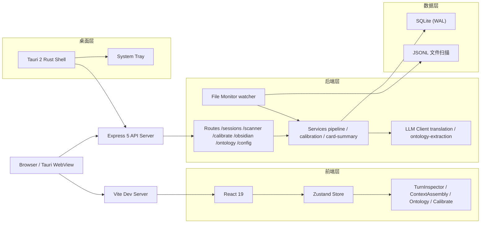

# LLM Context Viz

[](https://nodejs.org/)
[](https://react.dev/)
[](https://www.typescriptlang.org/)
[](package.json)
[](LICENSE)
[](https://tauri.app/)

> LLM 对话上下文可视化工具——扫描本地 Claude Code / Codex 会话记录，以交互式 UI 展示 token 分布、turn 结构与上下文演变。

<br>

LLM Context Viz 是一个基于 **Express + React** 构建的本地工具，支持将 LLM 会话 JSONL 文件导入 SQLite 数据库，并提供多维度的可视化分析。核心特性：

- **会话扫描** — 递归扫描 `~/.claude/projects/` 和 `~/.codex/` 目录，SHA256 去重，增量导入
- **Turn 检查器** — 按 turn 粒度拆解 token 分布（模型 / 子代理 / 工具 / 系统 / 用户），支持分页
- **上下文组装视图** — 柱状图展示 context window 内 token 占用，按类别（system prompt、tool call、content block）拆解
- **LLM 翻译** — 对 tool call 参数 / 结果进行中文翻译（Anthropic API / 兼容端点）
- **本体提取** — 从会话内容中自动提取概念节点和关系边，SSE 流式返回，支持导出 Obsidian 知识卡片
- **校准系统** — 校准 LLM 分析参数（手动 + 自动检测），用于分类器微调
- **模型配置** — 管理 API key、自定义端点、模型选择
- **桌面打包** — Tauri 2 封装为 macOS 原生应用，带系统托盘

<br>

## 服务架构



<br>

## 快速开始

### 本地开发

```bash
git clone https://github.com/ghoshadow/llm-context-viz.git
cd llm-context-viz
npm install

# 开发模式（前端 + 后端同时启动）
npm run dev          # Vite dev server（前端，端口 5173）
npm run server       # Express API server（后端，端口 4137）
```

### 桌面应用

```bash
npm run tauri:dev    # Tauri 开发模式
npm run tauri:build  # 生产构建 macOS .app
```

### 首次启动

1. （可选）配置 LLM API 密钥以启用翻译和本体提取功能
2. 打开前端页面，点击「扫描会话」导入本地 JSONL 文件
3. 选择会话进入 Turn 检查器或上下文组装视图

<br>

## WebUI 页面

| 页面 | 路由 | 说明 |
| :-- | :-- | :-- |
| 首页 | `#home` | 会话列表、扫描入口、模型配置 |
| Turn 检查器 | `#inspector` | 单次对话 turn 的 token 分布详情 |
| 上下文组装 | `#assembly` | 柱状图展示 context window token 占用 |
| 本体图谱 | `#ontology` | 概念节点和关系边的可视化 |
| 校准面板 | `#calibrate` | LLM 分析参数校准与管理 |
| 扫描弹窗 | 全局 | 选择会话来源、预览、导入 |

<br>

## 环境变量

| 变量 | 说明 | 默认值 |
| :-- | :-- | :-- |
| `PORT` | 服务器端口 | `4137` |
| `ANTHROPIC_API_KEY` | Anthropic API 密钥 | — |
| `ANTHROPIC_BASE_URL` | 自定义 API 端点 | `https://api.anthropic.com` |
| `ANTHROPIC_MODEL` | 默认模型 | `claude-sonnet-4-6` |
| `LLM_BASE_URL` | LLM 翻译端点（OpenAI 兼容） | `https://api.deepseek.com/anthropic` |
| `LLM_API_KEY` | LLM 翻译 API 密钥 | — |
| `LLM_MODEL` | LLM 翻译模型 | `deepseek-v4-pro` |
| `NODE_ENV` | 运行环境 | `development` |
| `DATA_DIR` | 数据目录（Web 模式） | `./data` |
| `LLM_CONTEXT_VIZ_DATA_DIR` | 数据目录（Tauri 桌面模式） | 系统应用数据目录 |

<br>

## API 一览

所有 API 前缀为 `/api`，默认监听 `http://localhost:4137`。

| 接口 | 方法 | 说明 |
| :-- | :-- | :-- |
| `/api/health` | `GET` | 健康检查，返回服务状态和数据目录 |
| `/api/sessions` | `GET` | 获取全部会话列表 |
| `/api/sessions/:id` | `GET` | 获取单个会话详情 |
| `/api/sessions/:id` | `DELETE` | 删除会话及其关联数据 |
| `/api/sessions/:id/turns` | `GET` | 获取会话 turn 列表（分页） |
| `/api/sessions/:id/turns/:index` | `GET` | 获取指定 turn 的完整数据 |
| `/api/sessions/:id/translate` | `POST` | 翻译会话中 tool call 内容 |
| `/api/sessions/:id/translate/constants` | `POST` | 翻译会话中项目常量 |
| `/api/sessions/:id/ontology/extract` | `POST` | 触发本体提取任务（SSE） |
| `/api/sessions/:id/ontology/card` | `POST` | 生成并导出 Obsidian 知识卡片 |
| `/api/scanner/scan` | `POST` | 扫描指定目录的 JSONL 文件 |
| `/api/scanner/import` | `POST` | 导入选中的 JSONL 文件 |
| `/api/scanner/files` | `GET` | 获取已扫描文件列表 |
| `/api/calibrate/constants` | `GET` | 读取校准常量 |
| `/api/calibrate/extract` | `POST` | 启动校准提取任务 |
| `/api/calibrate/apply` | `PUT` | 应用校准常量 |
| `/api/calibrate/job` | `GET` | 查询校准任务状态 |
| `/api/obsidian/config` | `GET` / `PUT` | 读写 Obsidian 集成配置 |
| `/api/config/model` | `GET` / `PUT` | 读写模型配置 |
| `/api/config/home` | `GET` | 获取用户 home 目录路径 |
| `/api/monitor/status` | `GET` | 获取文件监控状态 |

<details>
<summary><code>GET /api/sessions</code> — 获取会话列表</summary>
<br>

```bash
curl http://localhost:4137/api/sessions
```

响应示例：

```json
[
  {
    "id": "abc123",
    "source": "claude",
    "cwd": "/Users/link/my-project",
    "title": "my-project",
    "turnCount": 42,
    "createdAt": "2026-06-15T10:30:00.000Z"
  }
]
```

<br>
</details>

<details>
<summary><code>GET /api/sessions/:id/turns</code> — 获取 turn 列表</summary>
<br>

```bash
curl "http://localhost:4137/api/sessions/abc123/turns?limit=50&offset=0"
```

| 参数 | 说明 |
| :-- | :-- |
| `limit` | 每页条数，默认 200，最大 500 |
| `offset` | 偏移量 |

<br>
</details>

<details>
<summary><code>POST /api/scanner/scan</code> — 扫描 JSONL 文件</summary>
<br>

```bash
curl -X POST http://localhost:4137/api/scanner/scan \
  -H "Content-Type: application/json" \
  -d '{"paths": ["~/.claude/projects/"]}'
```

| 字段 | 说明 |
| :-- | :-- |
| `paths` | 要扫描的目录路径列表，支持 `~` 展开 |

<br>
</details>

<details>
<summary><code>POST /api/sessions/:id/translate</code> — 翻译 tool call</summary>
<br>

```bash
curl -X POST http://localhost:4137/api/sessions/abc123/translate \
  -H "Content-Type: application/json" \
  -d '{"turnIndex": 3, "stepIndex": 1}'
```

| 字段 | 说明 |
| :-- | :-- |
| `turnIndex` | Turn 序号（从 0 开始） |
| `stepIndex` | Step 序号 |

<br>
</details>

<details>
<summary><code>POST /api/sessions/:id/ontology/extract</code> — 本体提取（SSE 流式）</summary>
<br>

```bash
curl -N -X POST http://localhost:4137/api/sessions/abc123/ontology/extract \
  -H "Content-Type: application/json" \
  -d '{"shardKey": "concept"}'
```

响应为 SSE 事件流，`data` 字段包含提取进度和结果节点。

| 字段 | 说明 |
| :-- | :-- |
| `shardKey` | 提取分片标识，用于增量缓存 |

<br>
</details>

<br>

## 配置体系

### 配置分层

| 位置 | 用途 | 生效时机 |
| :-- | :-- | :-- |
| `.env` | 启动前配置（LLM 密钥、端口等） | 服务启动时 |
| `data/llm-context.db` | 运行时数据（会话、校准、Obsidian 配置） | 保存后即时生效 |
| 前端 ModelConfig | 模型选择和 API 端点 | 即时生效 |

### 模型配置项

通过前端 ModelConfig 弹窗或 `PUT /api/config/model` 接口配置：

| 配置项 | 说明 |
| :-- | :-- |
| Anthropic API Key | Anthropic API 密钥 |
| Anthropic Base URL | 自定义 API 端点地址 |
| Anthropic Model | 模型 ID（如 `claude-sonnet-4-6`） |

### 校准配置项

通过校准面板或 API 管理，存储在 `calibration_constants` 表中：

| 分组 | 关键项 |
| :-- | :-- |
| 分类阈值 | `tool_call_threshold`、`thinking_threshold`、`content_threshold` |
| Token 估算 | `chars_per_token`、`overhead_per_turn` |
| 来源适配 | 按 `claude` / `codex` 来源分别维护独立常量集 |

<br>

## 项目结构

```
llm-context-viz/
├── server/                  Express 5 API
│   ├── routes/              路由（sessions, scanner, calibrate, obsidian, ontology, config）
│   ├── services/            业务逻辑（pipeline, calibration, card-summary）
│   ├── repositories/        SQLite 数据访问层
│   ├── llm/                 LLM 客户端（翻译、本体提取）
│   ├── monitor/             文件系统监控
│   ├── obsidian/            Obsidian 集成（卡片生成、同步）
│   ├── middleware/          请求校验（Zod schema）
│   ├── content/             会话内容提取与导出
│   └── utils/               日志脱敏等工具
├── src/                     React 19 前端
│   ├── components/
│   │   ├── pages/           主要页面（TurnInspector, ContextAssembly, CalibratePage）
│   │   ├── home/            首页
│   │   ├── ontology/        本体图谱
│   │   ├── shared/          可复用 UI（ContentRenderer, MarkdownBlock, DiffView）
│   │   └── upload/          扫描弹窗
│   ├── store/               Zustand store（sessionStore, uiStore）
│   ├── api/                 HTTP 客户端（fetch + AbortController）
│   ├── pipeline/            会话数据处理管道（纯逻辑，无 JSX）
│   ├── hooks/               React hooks（useMonitor）
│   ├── styles/              设计 token（oklch 颜色）
│   ├── types/               共享 TypeScript 类型
│   └── utils/               格式化、SSE 客户端
├── shared/                  跨层共享
│   ├── constants.ts         应用常量
│   └── types/               校准类型定义
├── src-tauri/               Tauri 2 桌面壳（Rust）
│   ├── src/lib.rs           主逻辑（启动 Express 子进程、系统托盘）
│   ├── src/main.rs          Windows 入口
│   ├── Cargo.toml           Rust 依赖
│   └── tauri.conf.json      Tauri 配置
├── scripts/                 构建脚本
│   ├── tauri-build.mjs      Tauri 构建前置
│   └── bundle-node.mjs      便携 Node.js 下载
├── data/                    SQLite 数据库 + 配置（运行时生成）
├── dist/                    Vite 构建输出
└── dist-server/             Server 构建输出
```

<br>

## 技术栈

| 层 | 技术 |
| :-- | :-- |
| 前端 | React 19 + Zustand 5 + Vite 6 + oklch 设计系统 |
| 后端 | Express 5 + better-sqlite3 (WAL) + Zod 校验 |
| LLM | Anthropic SDK + OpenAI 兼容端点 |
| 桌面 | Tauri 2 (Rust) + 便携 Node.js |
| 构建 | esbuild 0.28 + TypeScript 5.6 |
| 测试 | `node:test` + `node:assert/strict`（内存 SQLite） |

<br>

## 测试

```bash
npm test          # 运行全部 server/src 下 .test.ts 文件
```

测试使用内存 SQLite（`:memory:`），不依赖外部数据库。测试文件与源文件同目录（`.test.ts` 命名）。

<br>

## 桌面应用

Tauri 2 桌面包运行内嵌 Express server + Vite 前端：

- 通过 ATS 例外支持 localhost HTTP 请求
- 打包前检测 API 端点地址类型（公网 / 内网 / 本机）以避免网络阻断
- 系统托盘显示当前活跃会话数量
- 应用关闭时自动清理 Node.js 子进程

构建产物结构：

```
.app/
  MacOS/
    llm-context-viz         # Tauri Rust 可执行文件
    node                     # 便携 Node.js v22.12.0
  Resources/
    _up_/dist-server/        # Express 后端（esbuild 打包 + 生产依赖）
    _up_/dist/               # Vite 前端产物
```

<br>

## 许可证

本项目基于 **GNU Affero General Public License v3.0 (AGPL-3.0)** 许可证开源。详见 [LICENSE](LICENSE) 文件。

> [!NOTE]
> 本项目仅供学习与研究交流。使用 LLM API 功能时请务必遵循相关服务的使用条款及当地法律法规。
